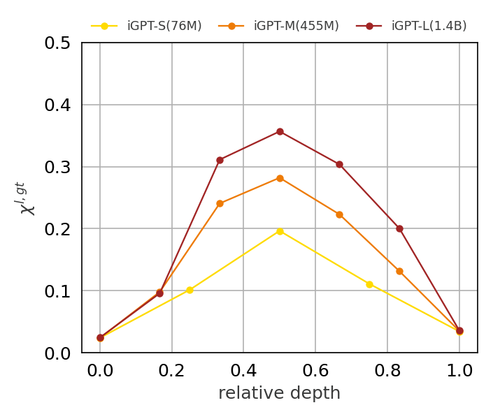
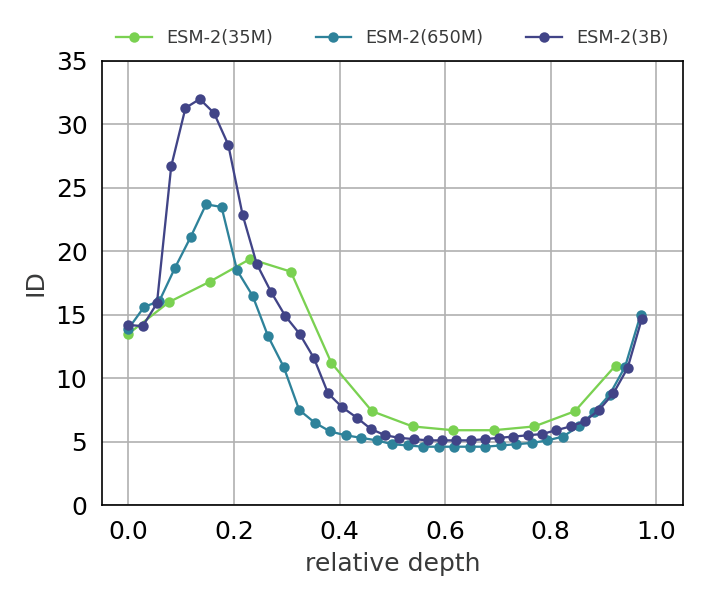
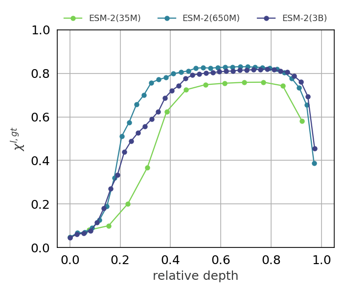

# The geometry of hidden representations of large transformer models

Source code of the paper  The geometry of hidden representations of large transformer models


## Platforms:
- Ubuntu 22.04

## Install

You can get miniconda from https://docs.conda.io/en/latest/miniconda.html. Then, install the dependencies shown below manually.

```
conda create -n  geom_transformers                            
conda activate geom_transformers
conda install python numpy matplotlib seaborn scikit-learn psutil
conda install pytorch    
pip install dadapy     
```

## Download the data to reproduce the plots in the paper
### Image
The intrinsic dimension estimation used the ratio of the distances between the second and first nearest neighbor of each data point. The overlap computation requires instead the knowledge of the neighborhood composition. The download.py script downloads the numpy arrays needed to reproduce the plots shown in the paper.

```
python download.py --dataset image
```

### Protein
For the protein analysis, the computation of intrinsic dimension will be directly provided as the overlap computation for the remote homology task. This will be improved in further updates.

```
python download.py --dataset protein
```

## Plot the intrinsic dimension and overlap profiles
### Image
Once you have downloaded the numpy arrays with the ratio of distances between the second and first nearest neighbor, the intrinsic dimension can be plotted with:
results/intrinsic_dimension_image.png
```
python plot_id_overlap.py --plot_id --dataset image
```


and the overlap with the ground truth labels with:

```
python plot_id_overlap.py --plot_overlap  --dataset image
```

# 


### Protein
Once you have downloaded the already computed IDs values and neighbor overlap values, you can plot the results with the following:

```
python plot_id_overlap.py --plot_id --dataset protein
```




```
python plot_id_overlap.py --plot_overlap  --dataset protein
```




## Compute the distance matrices 
### Image

If you'd like to compute yourself the distance matrix of other hidden representations of the ImageNet dataset:

   * #### Download the i-gpt pretrained models following the instructions at https://github.com/openai/image-gpt 


   * #### Compute the nearest neighbor matrix of an hidden layer representation:

   To compute the nearest neighbor matrix, you need to store the pre-trained model weights in "model_folder" and the ImageNet dataset in "imagenet_folder." 

   To compute the distance matrix of the 'layer 16' of the iGPT 'small' architecture on the ImageNet training set type:

    ```
    python  get_distance_matrices.py --model small --ckpt_path "model_folder" --data_path "model_folder" --trainset --hidden_repr 16
    ```

### Protein 


